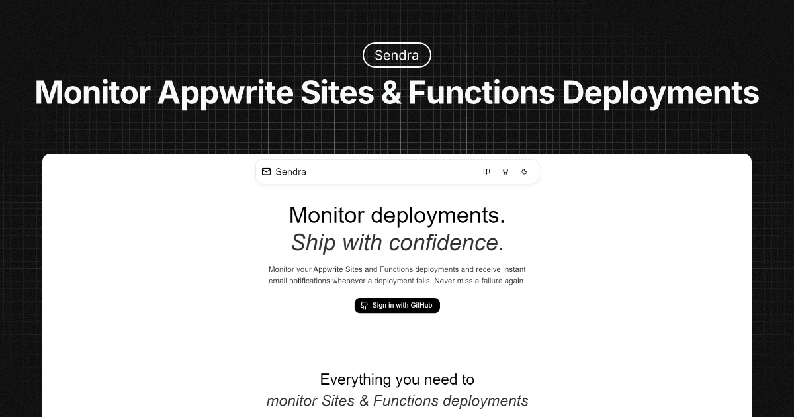

[](https://vercel.com/new/clone?repository-url=https://github.com/AbhiVarde/abhivarde.in)

# 🪴 Introducing Sendra

**Monitor Appwrite Sites & Functions Deployments.**

Never miss a failed deployment! Sendra monitors your Appwrite Sites and Functions deployments and sends instant email alerts when something goes wrong.



## 🎯 Problem

Appwrite doesn't send email notifications for failed deployments like Vercel does. Sendra fills this critical gap by monitoring your Appwrite projects (both Sites and Functions) and alerting you instantly when deployments fail.

## ✨ Key Features

- 🔐 **GitHub Login** – Secure and instant authentication
- 🔌 **Connect Projects** – Add Project ID & API Key to start monitoring
- 📡 **Automatic Monitoring** – Tracks Sites & Functions deployments in real time
- 📊 **Dashboard Overview** – View latest status, history, and analytics
- 🌍 **Region Support** – Works across all 6 Appwrite Cloud regions
- 👤 **Appwrite Avatars** – Clean user initials, region flags, and QR codes
- 📧 **Email Alerts** – Alerts you instantly for **new** failed deployments
- 🧠 **AI Log Analysis** – Explains failure logs & suggests possible fixes
- 💬 **Slash Commands** – `/overview`, `/failed`, `/help` for quick insights
- 🔒 **Encrypted Storage** – API Keys encrypted securely
- 🕐 **Automated Checks** – Cron job runs every 5 minutes
- 🚀 **Fast Setup** – Add your project details & start monitoring in minutes

## 🌍 Supported Regions

Monitor your Appwrite deployments globally across all available regions:

| Region           | Code | Location      |
| ---------------- | ---- | ------------- |
| 🇩🇪 Frankfurt     | FRA  | Germany       |
| 🇺🇸 New York      | NYC  | United States |
| 🇦🇺 Sydney        | SYD  | Australia     |
| 🇺🇸 San Francisco | SFO  | United States |
| 🇸🇬 Singapore     | SGP  | Singapore     |
| 🇨🇦 Toronto       | TOR  | Canada        |

## 🛠️ Tech Stack

- **Frontend:** Next.js, Material UI, TypeScript
- **Backend:** Appwrite Functions & Database
- **Authentication:** GitHub OAuth
- **UI Enhancements:** Appwrite Avatars (initials, flags, QR)
- **Email Service:** Resend API
- **AI Analysis**: Vercel AI SDK powered by Gemini
- **Deployment:** Vercel
- **Security:** Encrypted API keys

## 🚀 How It Works

1. **Login** with GitHub
2. **Add Your Project** – Project ID, API Key, region, and email
3. **Sendra Monitors Automatically** – Cron checks deployments every 5 minutes
4. **Get Alerts** – Email notifications for **new** failed deployments
5. **AI Analysis** – Logs analyzed to suggest potential fixes
6. **Use Command Interface** – Quickly get insights via slash commands like  
   `/overview`, `/failed`, `/help`
7. **Check Dashboard** – View real-time status, history, and analytics anytime

## 📦 Installation & Setup

### Prerequisites

- Node.js 18+
- Appwrite account
- Resend account for email notifications

### Local Development

```bash
# Clone the repository
git clone https://github.com/AbhiVarde/sendra.git
cd sendra

# Install dependencies
npm install

# Set up environment variables
cp .env.example .env.local
# Add your GitHub OAuth, Appwrite, and Resend credentials

# Run the development server
npm run dev
```

### Environment Variables

```env
NEXT_PUBLIC_APPWRITE_ENDPOINT=
NEXT_PUBLIC_APPWRITE_PROJECT_ID=
NEXT_PUBLIC_APPWRITE_DATABASE_ID=
NEXT_PUBLIC_APPWRITE_COLLECTION_ID=
NEXT_PUBLIC_APPWRITE_FETCH_DEPLOYMENTS_FUNCTION_ID=
NEXT_PUBLIC_APPWRITE_ENCRYPTION_SECRET=

RESEND_API_KEY=
RESEND_INBOUND_WEBHOOK_SECRET=
```

## 📂 Appwrite Setup

### 🏗️ Collections

- **sendra**: `userId`, `projectId`, `deployments`, `functionDeployments`, `trackedDeployments[]`, `trackedFunctionDeployments[]`, `alerts`, `email`, `isActive`, `apiKey`, `region`, `$id`, `$createdAt`, `$updatedAt`

### ⚡ Functions

- The monitoring logic runs on Appwrite Functions with a cron schedule, checking both Sites and Functions deployments

## 🤝 Contributing

1. Fork the repository
2. Create a feature branch (`git checkout -b feature/amazing-feature`)
3. Commit changes (`git commit -m 'feat: add amazing feature'`)
4. Push to branch (`git push origin feature/amazing-feature`)
5. Open Pull Request

**Development Guidelines:**

- Follow existing code patterns
- Test error scenarios thoroughly
- Maintain responsive design
- Keep commits focused and descriptive

## 💖 Support

**Love Sendra? Help me keep building!**

- 💚 **$5 / month - Monthly Supporter** → Recognition in the GitHub README
- 🌟 **$19 / month - Monthly Sponsor** → README + Portfolio recognition
- 🚀 **$49 / month - Featured Sponsor** → README + Portfolio + promotion on Sync UI

[👉 Become a Sponsor](https://github.com/sponsors/AbhiVarde)

## License

Sendra is licensed under the [MIT License](http://choosealicense.com/licenses/mit/). All rights reserved.

## Authors

Sendra is created and maintained by [Abhi Varde](https://www.abhivarde.in/).

---

⭐ **Found this helpful? Give it a star!**
